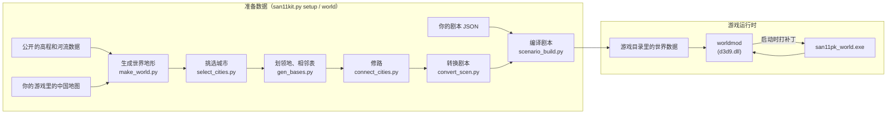

# 原理简介

这篇用不写代码的方式讲清楚：一个 2006 年的游戏，地图怎么从中国变成欧亚大陆，城市怎么从 42 座变成 500 座。
想看每个细节（地址、汇编、补丁表），读 [TUTORIAL.md](../TUTORIAL.md)。

## 一张图看懂

## 第一件事：让游戏装得下更大的地图

游戏把地图存在几个固定大小的数组里，每个数组正好装 200×200 格。地图要变大，就得给它换更大的数组。

我们没有改游戏的 exe 文件，而是做了一个叫 worldmod 的 `d3d9.dll`。游戏启动时会加载系统的 `d3d9.dll`（画 3D 用的），
把我们的同名文件放在游戏目录里，游戏就会先加载它。worldmod 在游戏真正开始之前，把内存里所有「200」「指向旧数组」的地方改掉，
指向它自己分配的大数组。这样的地方有四千多处，每一处都记在补丁表（`worldmod/*.txt`）里。

有些地方原来的指令太短，放不下新的数字（比如原来只用 1 个字节存「42」，放不下「500」）。这时 worldmod 把那几条指令
换成一个跳转，跳到一小段新写的代码（叫「代码洞」）里做同样的事，再跳回来。这样的代码洞有九百多段。

删掉 `d3d9.dll`，游戏就回到原版。原版的 `san11pk.exe` 也一直能正常玩原版。

## 第二件事：画一张光荣风格的世界地图

地形来自真实的高程数据（NOAA ETOPO）和河流数据（Natural Earth），但如果直接按真实高程分平原和山，
放在光荣的中国旁边会一眼看出不一样。光荣的地图不写实：山占陆地的一半，大河有四五格宽，草地、森林、荒地是小块混在一起的。

所以生成器先「学」光荣中国地图的统计：山的比例、河的宽度、各种地形的比例和斑块大小，再按同样的统计去画世界。
中国本身原样嵌在中间，边缘的山和河一直延续出去，看不出接缝。3D 地表的高度和材质也是照着光荣中国的样子生成的。

## 第三件事：放城市

城市候选表里有几百座历史城市，带真实经纬度。按重要程度从高到低一座一座放，离已有城市太近（少于 14 格）就跳过，
所以城市的疏密和光荣的中国差不多。

每座城的「领地」用最短路算出来：每一格归走过去最近的那座城。山和河走起来慢，所以领地的边界会顺着山脊和河流，
像拼图一样拼在一起。领地挨着的城就是「相邻」城市，AI 打仗、玩家出征都靠这张相邻表。

城市之间沿相邻关系修路：平地修主径，山上修栈道，河上修渡口。

## 第四件事：城市超过 255 座

游戏里有些地方只用 1 个字节记城市编号，最多到 255。超过 255 座据点（城 + 关 + 港）就得把这些地方都改成 2 个字节：
存档里的几个字段、AI 记录的进攻目标、AI 挑城市用的随机函数……全都改了。存档文件也跟着变了，worldmod 会在新存档上
做一个标记，读档时按标记判断新旧格式，所以旧存档还能读。

## 第五件事：剧本

光荣的 14 个剧本只认识 42 座城。转换器把每个剧本改成新的城市数：新城都插进去、一开始无主，其余内容原样保留。
你写的剧本 JSON 再在这个基础上加势力、武将、改城市归属。

剧本文件的格式（每个武将 152 字节、每个势力 73 字节……）是从游戏读剧本的代码里一个字段一个字段读出来的，
写在 `tools/scenario_build.py` 的开头。

## 第六件事：界面

- **中地图**：光荣的中地图是一张手绘的中国，没法扩展。worldmod 改成自己画：按地形和领地实时画出整个世界，
  颜色还是用游戏自己的势力配色，城市标记、鼠标悬停提示也都还是游戏原来的。再加上滚轮缩放和拖动。
- **小地图**：跟着镜头走，画面也是从光荣原来的小地图里学的配色。
- **寻路**：地图大了以后，原版的寻路算法太慢（一次要近 1 秒），换成了更快的写法，找到的路一样短。
- **自动跳过**：启动时不播开场动画，进地图后自动点掉开场剧情。

## 工具都在哪

| 做什么 | 工具 |
|---|---|
| 一条命令完成上面所有准备工作 | `san11kit.py` |
| 每一步单独运行 | `tools/` 里同名的脚本，开头都有说明 |
| 在浏览器里改地形和城市 | `tools/editor/` |
| 游戏里运行的部分（C++） | `worldmod/src/` |
| 补丁点从哪来（逆向笔记） | 根目录的 `*.md`、`m7_struct_sites.jsonl` 等 |
